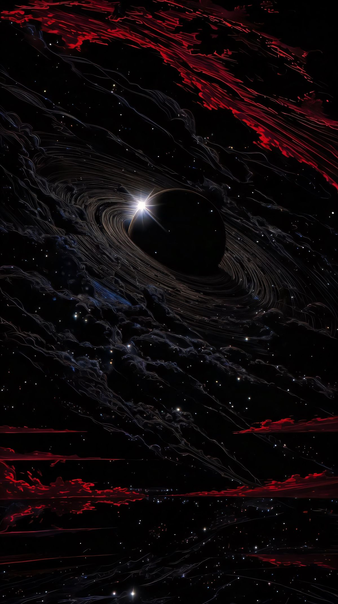
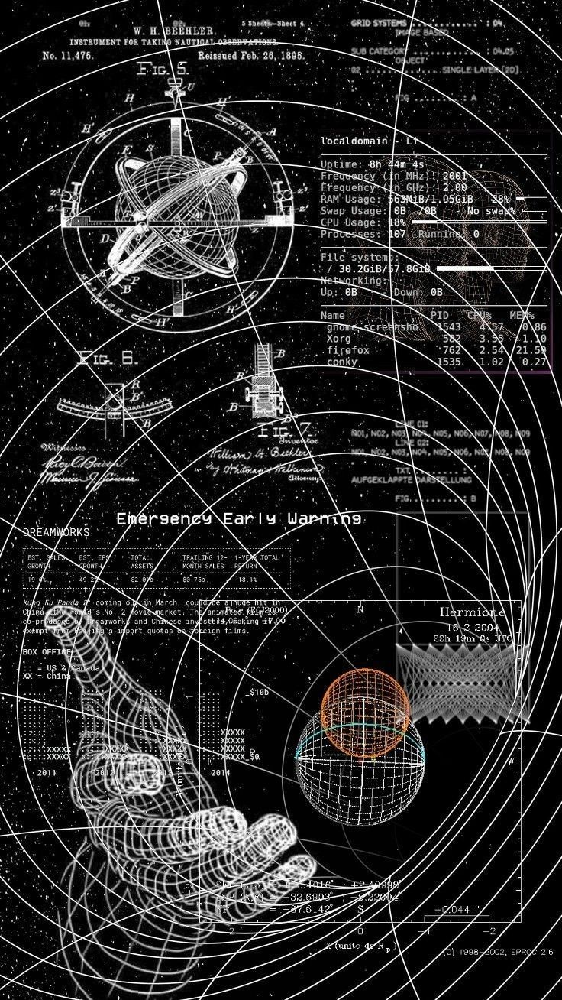

  <i>✨ Esta página se actualiza dinámicamente con GitHub
Action y utiliza i18n para el lenguaje</i>

 

 

   
  
  
  
  

 

Hola, soy <b>Denis</b> un desarrollador de software entusiasta y ambicioso. Me especializo en Desarrollo Web, React JavaScript y Diseño. Me encanta hacer contactos, aprender, enseñar, resolver problemas y me considero un entusiasta de la automatización.

Me encanta enfrentar desafíos complejos, construir soluciones escalables y compartir conocimientos con los demás.

También me gusta explorar y aprender sobre el espacio, agujeros negros, física, cuántica y cualquier cosa interesante.

  
 Más sobre mí 

- Actualmente estoy en un viaje para construir **grandes** cosas.

- Actualmente estoy aprendiendo **todo**

- También creé un canal de discord, además de una página de documentación para ayudar a los coders de Riwi a entender fundamentos de programación en [noLearn](https://nolearn-dev.web.app/)

- Toda mi experiencia en programación está disponible en [Linkedin](https://www.linkedin.com/in/denisanchez/)

- Contáctame en **contact.denis.sanchez@gmail.com**

  

## 🔥 Estadísticas de GitHub

  
  
  

## Estadísticas de CodeWars
  

<a href="https://www.codewars.com/users/DenisV2103">
 
 
  
 

 
 

</a>

 

## ⚡ Conocimientos
**Languages:** 

  

**Frameworks & Libraries:** 

  

**Styling:** 

  

**Databases:** 

  

**Tools:** 

 

## Gracias por visitar mi perfil

⭐ **"La capacidad de aprender es un don; la habilidad de aprender es una destreza; la voluntad de aprender es una elección." - Brian Herbert**

<a width="48%" href="https://custom-github-overview.vercel.app/docs/selector.html" alt="Change language">
  
  <b>Español</b>
 </a>
<i>Haz clic en el globo para cambiar el idioma</i>

<i>Última actualización: <b>28/10/2025</b></i>

